# Real-Estate Ease - Project Blackbook

## Project Overview

**Project Name:** Real-Estate Ease  
**Type:** Web-based Real Estate Management System  
**Status:** Completed  
**Development Methodology:** Agile

### Purpose
Real-Estate Ease is a comprehensive web-based Real Estate Management System designed to streamline property management operations for real estate companies. The application enables efficient management of property inventory, client visits, bookings, sales, and payments with robust security features and role-based access control.

### Core Objective
To develop a scalable, user-friendly, and secure Real Estate Management System that enhances operational efficiency, transparency, and data-driven decision-making through advanced visualization and automation capabilities.

---

## Technology Stack

### Frontend Technologies
- **Framework:** React with TypeScript
- **Build Tool:** Vite
- **Styling:** 
  - Tailwind CSS (utility-first styling)
  - SCSS (enhanced CSS preprocessing)
  - Shadcn UI (component library)
- **State Management:** Zustand
- **Data Fetching:** TanStack Query (React Query) with Axios
- **Validation:** Zod
- **Charts & Visualization:** Recharts

### Backend Technologies
- **Runtime:** Node.js
- **Framework:** Express.js
- **Authentication:** JWT (JSON Web Tokens)
- **Security:** 
  - Bcrypt (password hashing)
  - Crypto JS (encryption)

### Database
- **Database:** MongoDB
- **ODM:** Mongoose

---

## Key Features & Modules

### 1. User Interface
- **Responsive Design:** Fully responsive across all device sizes
- **Theme Support:** Light and Dark mode toggle
- **Modern UI/UX:** Clean, intuitive interface using Shadcn UI components

### 2. User Management Module
**Features:**
- Users table with advanced filtering capabilities
- Comprehensive user details page
- Full CRUD operations (Create, Read, Update, Delete)
- User account controls (lock/unlock functionality)
- Password reset capabilities for authorized users
- Custom role creation with granular permissions
- Multi-role assignment per user
- Page-level access control based on assigned roles

**Key Functions:**
- Add new users with role assignments
- Edit user information and permissions
- Lock/unlock user accounts
- Reset user passwords
- Delete users (with proper authorization)
- Filter and search users by various criteria

### 3. Role & Permission Management
**Features:**
- Custom role creation
- Fine-grained permission management
- Role-based access control (RBAC)
- Page and feature-level restrictions
- Multiple roles per user support

**Permission Types:**
- Module access permissions
- CRUD operation permissions
- Special action permissions (lock/unlock, delete, etc.)
- Report generation permissions

### 4. Client Management Module
**Features:**
- Client table with advanced filtering
- Comprehensive client details page
- Full CRUD operations for client records
- Client history tracking
- Contact management

**Data Managed:**
- Client personal information
- Contact details
- Property preferences
- Visit history
- Booking history
- Payment records

### 5. Client Visit Tracking
**Features:**
- Visit scheduling and management
- Visit status tracking
- Visit history per client
- Full CRUD operations
- Visit outcome documentation

**Tracked Information:**
- Visit date and time
- Property visited
- Visit outcome
- Follow-up requirements
- Agent/staff assigned

### 6. Channel Partner Module
**Features:**
- Channel partner registration
- Partner details page
- Full CRUD operations
- Commission tracking
- Performance metrics

**Managed Data:**
- Partner information
- Contact details
- Associated clients
- Commission structure
- Deal history

### 7. Booking Management Module
**Features:**
- Bookings table with advanced filtering
- Full CRUD operations
- Booking status tracking
- Cancellation management
- PDF generation for booking confirmations
- PDF generation for cancellation receipts

**Booking Details:**
- Property details
- Client information
- Booking date
- Payment schedule
- Status tracking
- Terms and conditions

### 8. Payment Management Module
**Features:**
- Payments table with comprehensive filtering
- Advanced payment form with validation
- Demand letter generation
- Payment history tracking
- Soft delete functionality
- Restore deleted payments
- Multiple payment mode support

**Payment Processing:**
- Payment recording
- Receipt generation
- Outstanding amount tracking
- Payment status management
- Installment tracking
- Demand letter creation

### 9. Inventory Management Module
**Features:**
- Property inventory table
- Full CRUD operations
- Dynamic unit/flat placement visualization
- Property status management
- Availability tracking

**Inventory Details:**
- Property specifications
- Unit layout
- Pricing information
- Availability status
- Floor plans
- Amenities

### 10. Reporting & Analytics
**Report Types:**
- Sales reports
- Payment reports
- Client reports
- Inventory status reports
- Visit tracking reports
- Channel partner performance reports

**Export Options:**
- PDF generation
- Excel export
- Advanced filtering for custom reports
- Date range selection
- Multi-parameter filtering

### 11. Data Visualization
**Chart Types:**
- Sales trends
- Payment collection metrics
- Inventory availability
- Client acquisition trends
- Visit conversion rates
- Revenue analysis

**Features:**
- Interactive charts using Recharts
- Real-time data updates
- Multiple visualization options
- Drill-down capabilities

### 12. Authentication & Authorization
**Security Features:**
- JWT-based authentication
- Bcrypt password hashing
- Secure session management
- Token expiration handling
- Password complexity requirements
- Account lockout after failed attempts

**Authorization:**
- Role-based access control
- Permission-based feature access
- Page-level authorization
- API endpoint protection

### 13. Audit & Logging System
**Audit Trail:**
- User action logging
- Timestamp recording
- IP address tracking
- Action type classification
- Data change tracking
- User identification

**Auth Table:**
- Session management
- Token logs
- Login/logout tracking
- Failed login attempts
- Session expiration records

**Audit Table:**
- Comprehensive audit log
- Advanced filtering capabilities
- Search functionality
- Export options

---

## System Architecture

### High-Level System Architecture

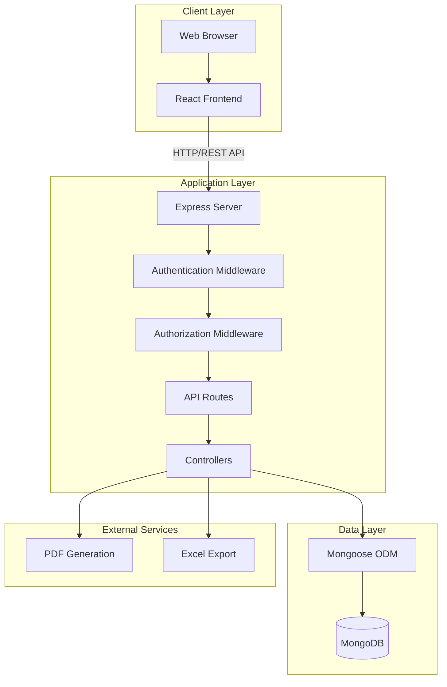

### Frontend Architecture
```
src/
├── components/        # Reusable UI components
├── pages/            # Page components
├── hooks/            # Custom React hooks
├── store/            # Zustand state management
├── services/         # API service layer
├── utils/            # Utility functions
├── types/            # TypeScript type definitions
├── schemas/          # Zod validation schemas
└── styles/           # SCSS and global styles
```

### Backend Architecture
```
server/
├── routes/           # API route definitions
├── controllers/      # Business logic
├── models/           # Mongoose schemas
├── middleware/       # Express middleware
├── utils/            # Helper functions
├── config/           # Configuration files
└── validators/       # Request validators
```

### Database Schema Design

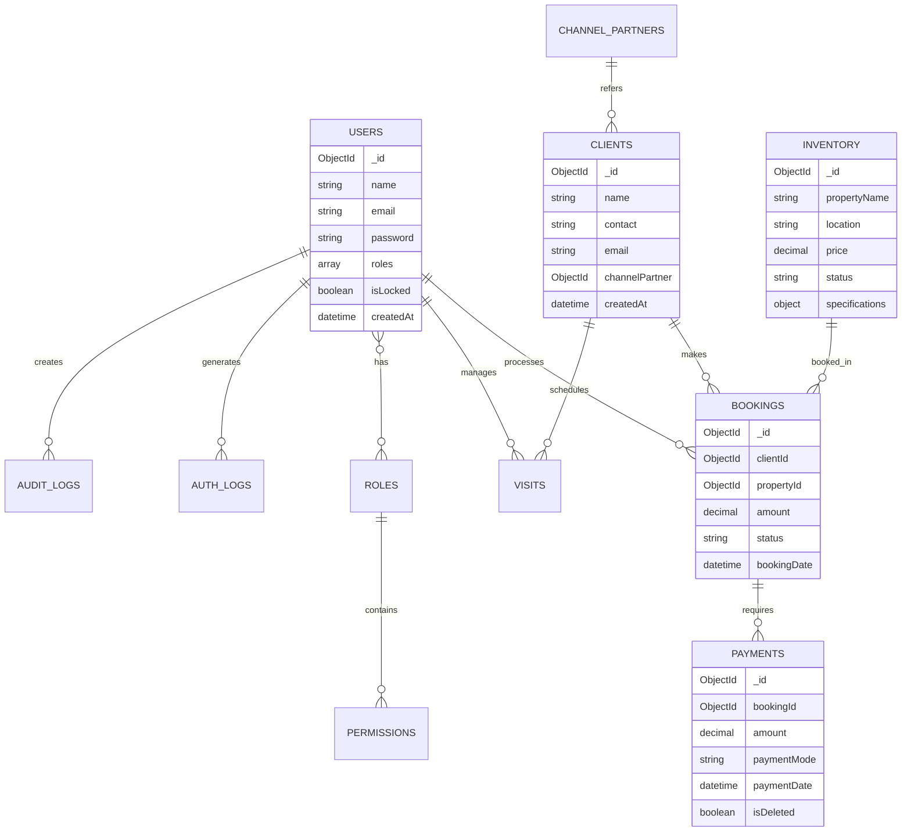

**Collections:**
- Users
- Roles
- Permissions
- Clients
- Visits
- ChannelPartners
- Bookings
- Payments
- Inventory
- AuditLogs
- AuthLogs

---

## Security Implementation

### Authentication Flow

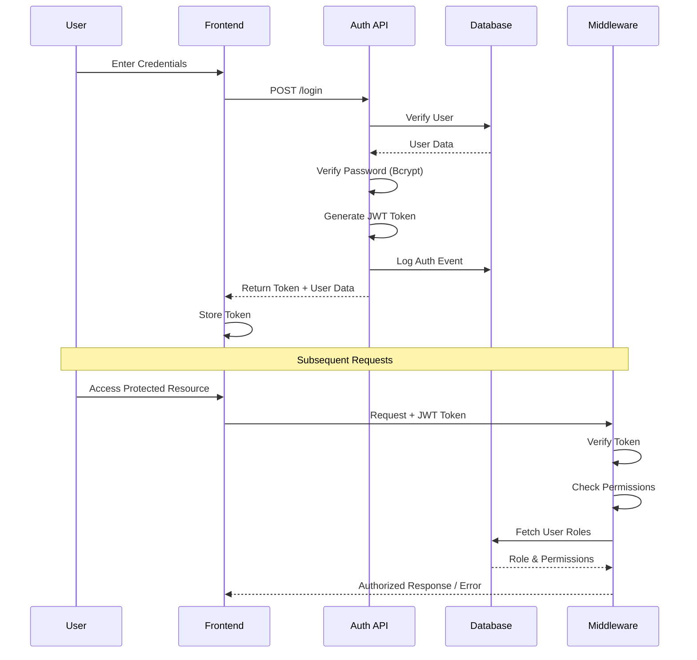

### Role-Based Access Control (RBAC) Flow

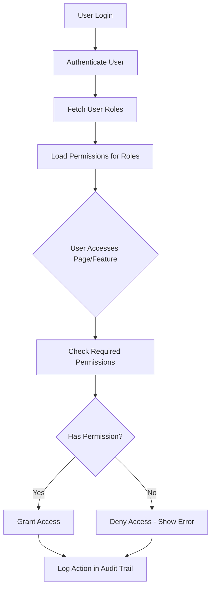

### Password Security
- Bcrypt hashing with salt rounds
- Password complexity requirements
- Secure password reset mechanism
- Password history (prevent reuse)

### Data Encryption
- Crypto JS for sensitive data encryption
- Encrypted data transmission
- Secure storage of sensitive information

### Authentication Security
- JWT token-based authentication
- Token expiration and refresh mechanism
- Secure token storage
- Session management

### Authorization Security
- Role-based access control
- Permission verification on every request
- Page-level authorization
- API endpoint protection

### Audit & Compliance
- Complete audit trail
- Action logging
- User activity tracking
- Data change history

---

## Key Improvements Over Existing Systems

### 1. Enhanced Security
- Fine-grained role and permission management
- Comprehensive audit logging
- Secure authentication with JWT
- Encrypted sensitive data

### 2. Superior User Experience
- Modern, responsive UI
- Dark/light mode support
- Intuitive navigation
- Advanced filtering and search

### 3. Comprehensive Reporting
- Multiple report formats (PDF/Excel)
- Custom report generation
- Advanced filtering options
- Scheduled reports capability

### 4. Integrated System
- Seamless module integration
- Real-time data synchronization
- Unified dashboard
- Cross-module data access

### 5. Data Visualization
- Interactive charts and graphs
- Real-time insights
- Multiple visualization types
- Drill-down analytics

### 6. Advanced Features
- Soft delete and restore functionality
- Dynamic inventory visualization
- Automated document generation
- Advanced payment tracking

---

## Module Integration Flow

### Client Journey Flow

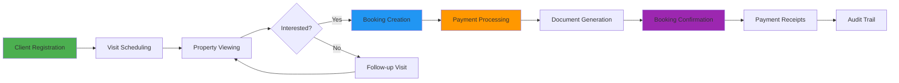

### Sales Process Flow

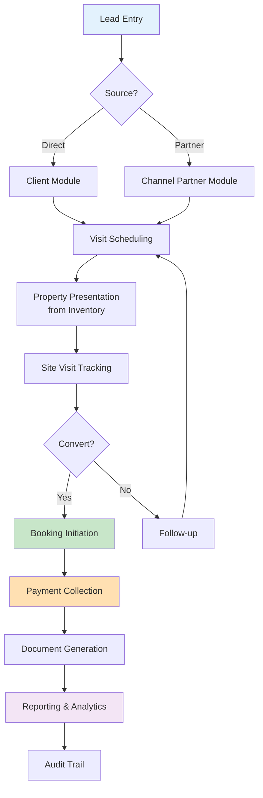

### Complete System Workflow

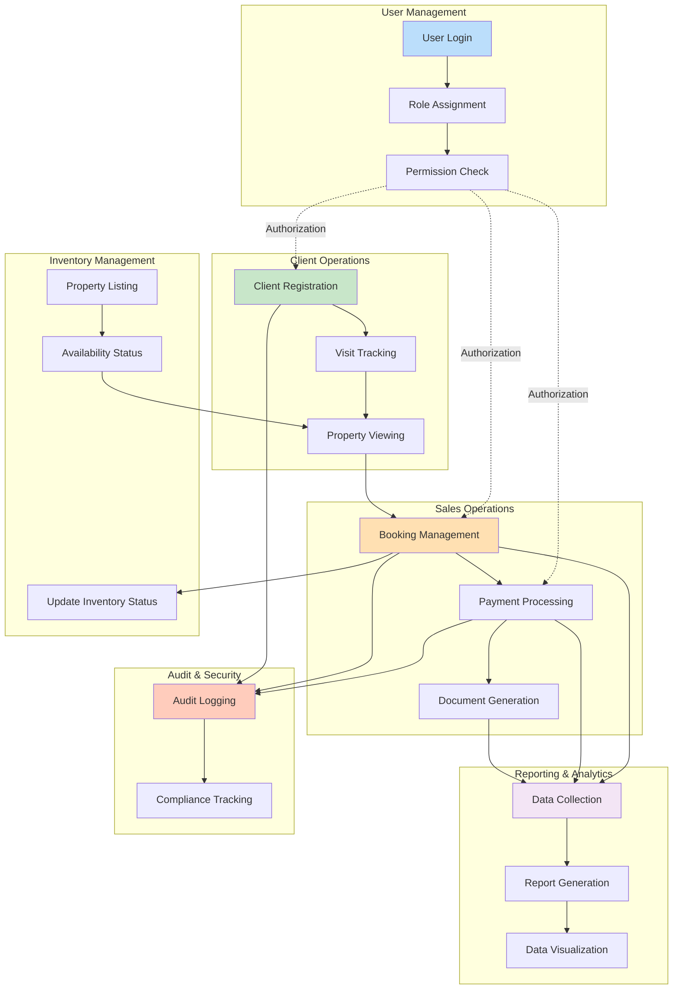

---

## User Roles & Permissions

### Role Hierarchy

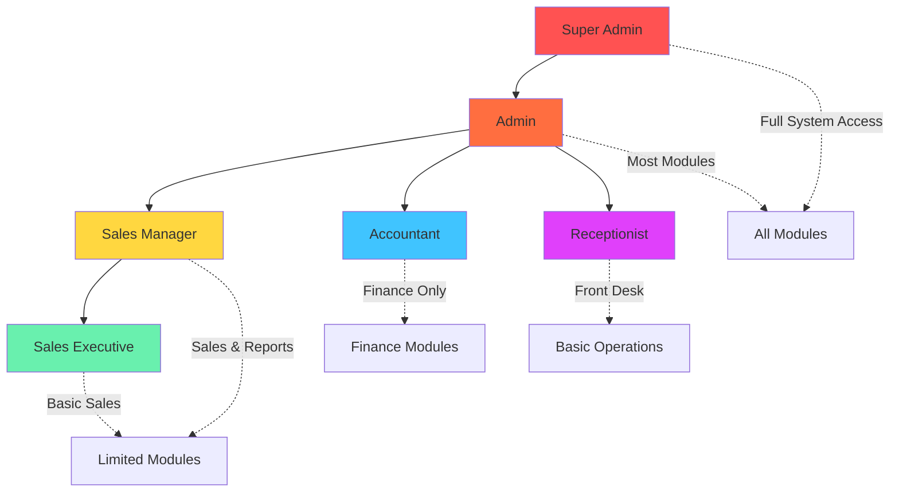

### Permission Matrix

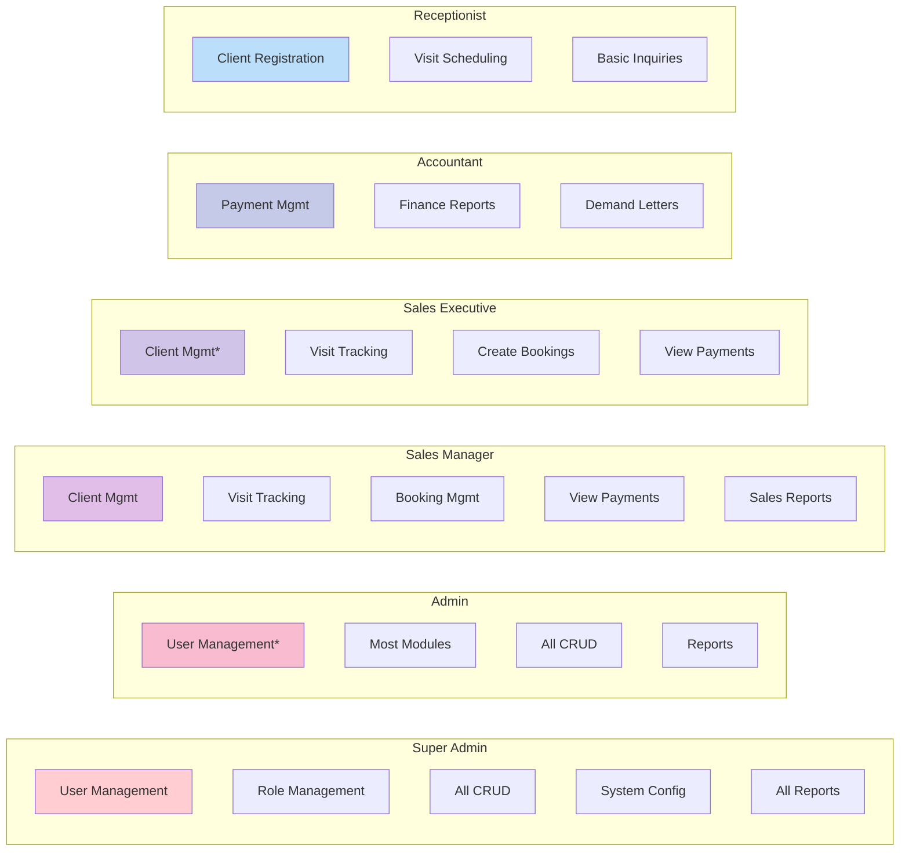

### Sample Role Structure

**Super Admin:**
- Full system access
- User management
- Role and permission management
- System configuration
- All CRUD operations

**Admin:**
- Most module access
- User management (limited)
- Full CRUD operations
- Report generation
- Cannot modify system roles

**Sales Manager:**
- Client management
- Visit tracking
- Booking management
- Payment viewing
- Report generation

**Sales Executive:**
- Client management (limited)
- Visit tracking
- Booking creation
- Payment viewing

**Accountant:**
- Payment management
- Financial reports
- Demand letter generation
- Payment verification

**Receptionist:**
- Client registration
- Visit scheduling
- Basic inquiries
- Limited access

---

## Data Management

### Data Flow Architecture

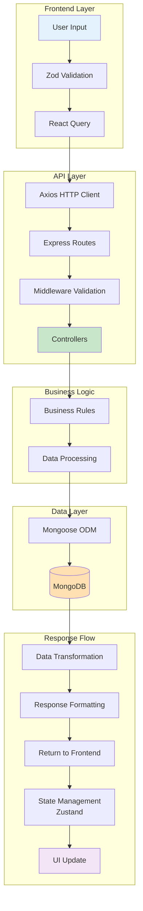

### CRUD Operations Flow

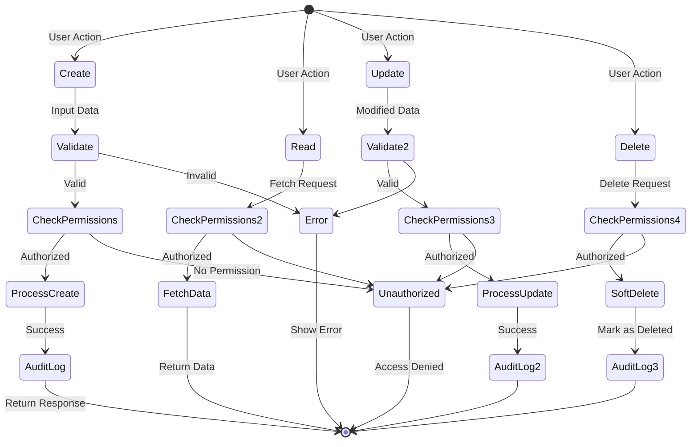

### CRUD Operations
All major modules support:
- **Create:** Add new records with validation
- **Read:** View detailed information with filtering
- **Update:** Modify existing records with audit trail
- **Delete:** Soft delete with restore capability

### Data Validation
- Frontend validation using Zod schemas
- Backend validation before database operations
- Type safety with TypeScript
- Input sanitization

### Data Export
- PDF generation for documents and reports
- Excel export for data analysis
- Custom export filters
- Formatted output with branding

---

## Reporting Capabilities

### Report Generation Flow

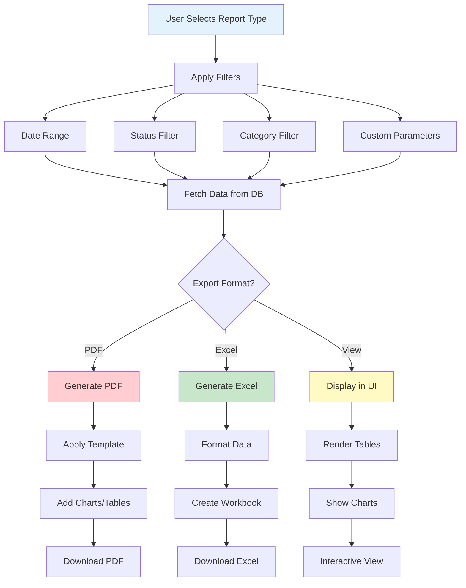

### Report Architecture

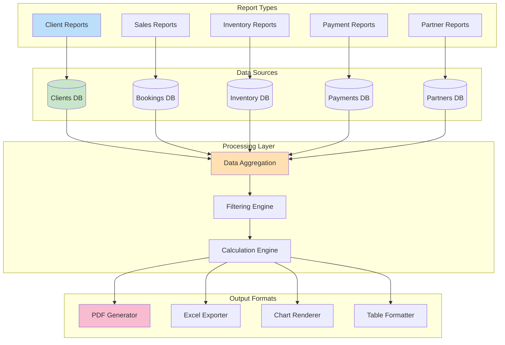

### Report Categories

**Client Reports:**
- Client list with filters
- Visit history per client
- Booking history
- Payment history

**Sales Reports:**
- Sales performance
- Booking trends
- Revenue analysis
- Conversion rates

**Inventory Reports:**
- Available properties
- Sold properties
- Property status summary
- Pricing analysis

**Payment Reports:**
- Payment collection
- Outstanding payments
- Payment mode analysis
- Demand letter tracking

**Channel Partner Reports:**
- Partner performance
- Commission summary
- Deal closure rates

### Report Features
- Date range selection
- Multi-parameter filtering
- Export to PDF/Excel
- Custom report builder
- Scheduled report generation

---

## Performance Optimization

### Frontend Performance Strategy

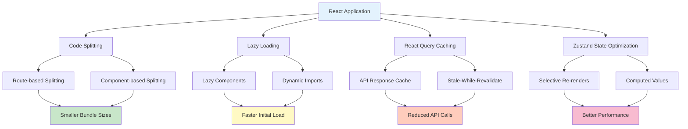

### Backend Performance Strategy

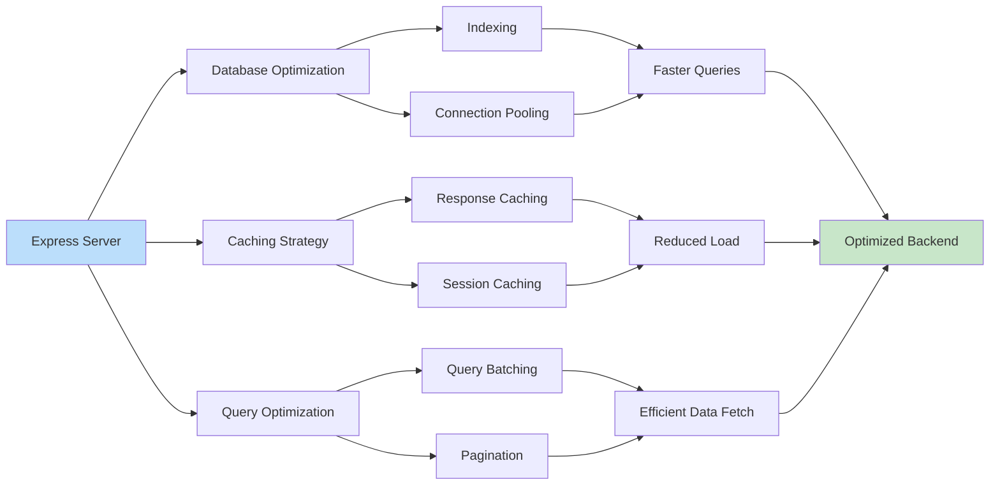

### Caching Architecture

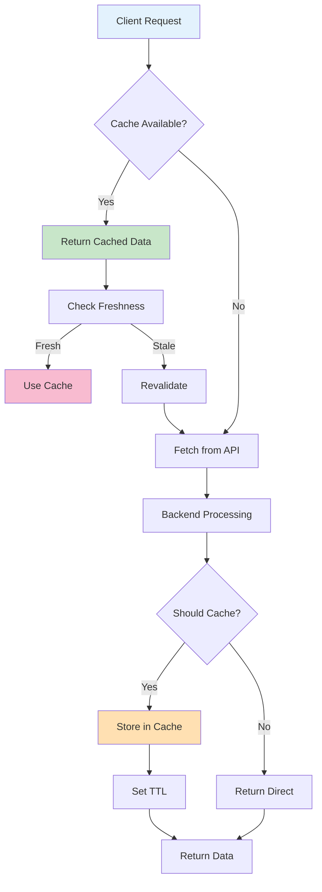

### Frontend Optimization
- Code splitting with Vite
- Lazy loading of components
- React Query caching
- Optimized re-renders with Zustand
- Image optimization

### Backend Optimization
- Database indexing
- Query optimization
- Caching strategies
- Efficient data pagination
- Connection pooling

---

## Development Process

### Agile Development Lifecycle

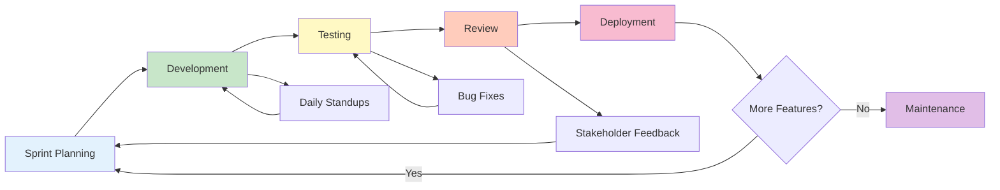

### Development Phases

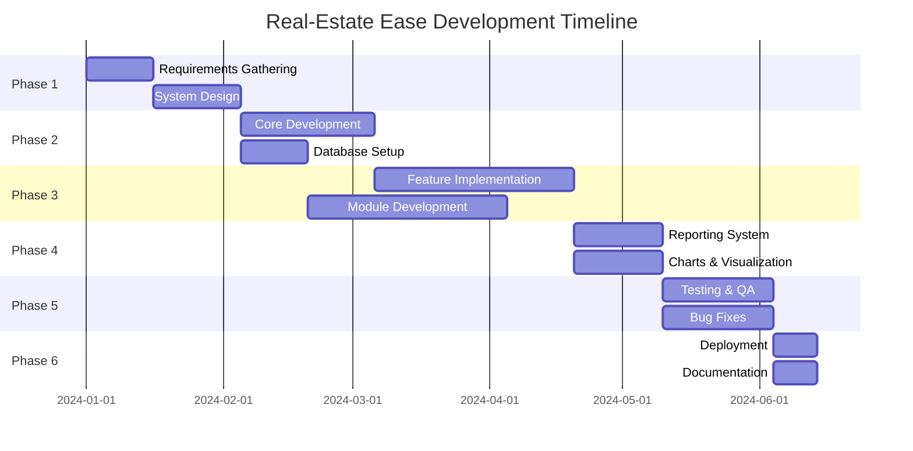

### Testing Strategy

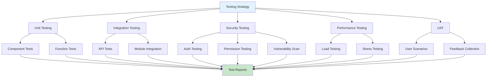

### Phase 1: Requirements & Design
- Requirement gathering and analysis
- Database schema design
- Role and permission structure design
- UI/UX mockups and wireframes
- Technology stack selection

### Phase 2: Core Development
- Authentication and authorization system
- User and role management
- Database setup and models
- API development
- Frontend component development

### Phase 3: Feature Implementation
- Client management module
- Visit tracking module
- Channel partner module
- Booking management module
- Payment management module
- Inventory management module

### Phase 4: Reporting & Visualization
- Report generation system
- Chart and graph implementation
- PDF/Excel export functionality
- Dashboard development

### Phase 5: Testing & Refinement
- Unit testing
- Integration testing
- Security testing
- Performance testing
- User acceptance testing

### Phase 6: Deployment & Documentation
- Production deployment
- User documentation
- Technical documentation
- Training materials
- Maintenance plan

---

## Maintenance & Support

### Regular Maintenance
- Database backup and recovery
- Performance monitoring
- Security updates
- Bug fixes
- Feature enhancements

### User Support
- User training
- Documentation updates
- Help desk support
- Issue resolution

### System Updates
- Technology stack updates
- Security patches
- Feature additions based on feedback
- Performance improvements

---

## Future Enhancement Opportunities

### Scalability Roadmap

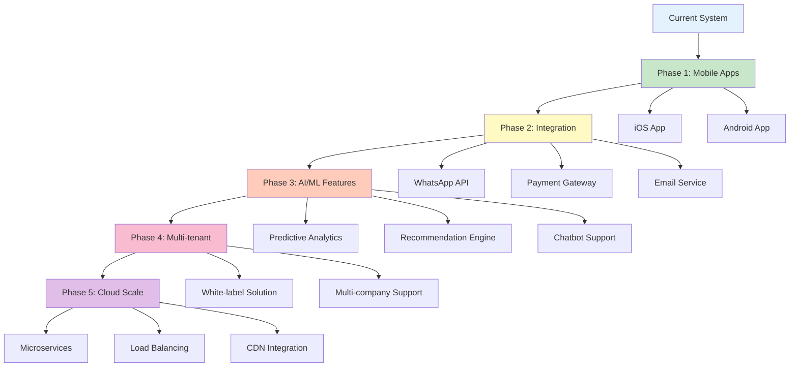

### Technology Evolution Path

```mermaid
flowchart LR
    subgraph "Current"
        A[Monolithic App]
        B[Single Database]
        C[Basic Reporting]
    end
    
    subgraph "Near Future"
        D[Mobile Apps]
        E[API Integrations]
        F[Advanced Analytics]
    end
    
    subgraph "Long Term"
        G[Microservices]
        H[Multi-tenant]
        I[AI/ML Features]
        J[Cloud Native]
    end
    
    A --> D
    B --> E
    C --> F
    
    D --> G
    E --> H
    F --> I
    
    G --> J
    H --> J
    I --> J
    
    style A fill:#BBDEFB
    style D fill:#C8E6C9
    style G fill:#FFE0B2
    style J fill:#F8BBD0
```

### Integration Opportunities

```mermaid
graph TB
    A[Real-Estate Ease Core] --> B[Payment Gateways]
    A --> C[Communication Services]
    A --> D[Document Services]
    A --> E[Analytics Platforms]
    A --> F[CRM Systems]
    
    B --> B1[Razorpay]
    B --> B2[Stripe]
    B --> B3[PayPal]
    
    C --> C1[WhatsApp Business API]
    C --> C2[Twilio SMS]
    C --> C3[SendGrid Email]
    
    D --> D1[DocuSign]
    D --> D2[Adobe Sign]
    D --> D3[Cloud Storage]
    
    E --> E1[Google Analytics]
    E --> E2[Mixpanel]
    E --> E3[Power BI]
    
    F --> F1[Salesforce]
    F --> F2[HubSpot]
    F --> F3[Zoho]
    
    style A fill:#E3F2FD
    style B fill:#C8E6C9
    style C fill:#FFF9C4
    style D fill:#FFCCBC
    style E fill:#F8BBD0
    style F fill:#E1BEE7
```

### Potential Features
- Mobile application (iOS/Android)
- WhatsApp/SMS integration for notifications
- Automated email campaigns
- Advanced analytics with AI/ML
- Property virtual tours integration
- Document management system
- CRM integration
- Payment gateway integration
- Multi-language support
- Multi-tenant architecture for multiple companies

### Scalability Considerations
- Microservices architecture
- Cloud deployment (AWS/Azure/GCP)
- Load balancing
- Horizontal scaling
- Caching layers (Redis)
- CDN integration

---

## Conclusion

Real-Estate Ease successfully addresses the limitations of existing real estate management systems by providing a comprehensive, secure, and user-friendly platform. With its robust feature set, modern technology stack, and focus on security and usability, it serves as a complete solution for real estate companies to manage their operations efficiently.

The application's modular architecture ensures easy maintenance and scalability, while its comprehensive reporting and visualization capabilities enable data-driven decision-making. The implementation of role-based access control and audit logging ensures security and compliance, making it suitable for organizations of all sizes.

---

## Project Metadata

**Development Period:** [Your timeline]  
**Team Size:** [Your team size]  
**Lines of Code:** [Approximate]  
**Modules:** 13 major modules  
**Database Collections:** 11+ collections  
**Supported Users:** Unlimited (scalable)  
**Deployment:** [Your deployment environment]

---

**Document Version:** 1.0  
**Last Updated:** October 12, 2025  
**Document Owner:** [Your name]  
**Project Status:** Completed
